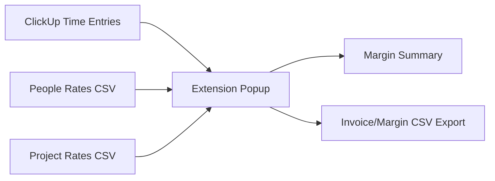

# Architecture Notes

## Current Prototype

This is a Manifest V3 Chrome extension with no build step.

- `manifest.json`: extension permissions and entry points.
- `popup.html` / `popup.js`: report generation and CSV export.
- `options.html` / `options.js`: ClickUp token, workspace, date range, people rates, project rates.
- `src/clickup.js`: ClickUp API client.
- `src/margin.js`: pure margin calculation.
- `src/csv.js`: CSV parsing/export helpers.
- `src/storage.js`: Chrome storage wrapper with localStorage fallback for browser preview.

## Data Flow



## Rate Tables

People rates:

```csv
clickup_user_id,username,cost_rate,default_bill_rate,role
216168054,Demo Admin,65,140,Project Manager
216168243,Marco,55,135,Designer
216168277,Alice,85,175,Senior Engineer
```

Project rates:

```csv
clickup_list_id,client,project,bill_rate,budget_hours,target_margin
901417274458,Acme Co,Website Redesign,150,80,0.55
```

## Google Sheets Direction

The prototype stores CSV tables in extension storage so the report can run today. The intended v1 product should use proper Google OAuth and a user-owned Google Sheet:

- Sheet tab `PeopleRates`
- Sheet tab `ProjectRates`
- Sheet tab `Reports`
- optional tab `TimeEntriesCache`

That keeps private rates in the user's Google account and avoids backend storage in v1.

## ClickUp API Notes

- `GET /api/v2/team` lists authorized workspaces.
- `GET /api/v2/team/{team_id}/time_entries` returns time entries.
- To fetch another user's time entries, include `assignee={clickup_user_id}`.
- Hydrate tasks with `GET /api/v2/task/{task_id}` when the time-entry payload does not include list/project location.

