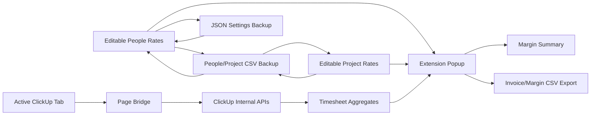

# Architecture Notes

## Current Prototype

This is a Manifest V3 Chrome extension with no build step.

- `manifest.json`: extension permissions and entry points.
- `popup.html` / `popup.js`: report generation and CSV export.
- `options.html` / `options.js`: report window, people rates, project rates.
- `content-script.js`: relays popup requests into the active ClickUp page.
- `page-bridge.js`: runs in the ClickUp page context, reuses the logged-in session, and calls ClickUp internal APIs.
- `src/margin.js`: pure margin calculation.
- `src/csv.js`: CSV parsing/export helpers.
- `src/storage.js`: browser-local storage wrapper using Chrome extension storage with localStorage fallback for browser preview.

## Data Flow

## Rate Tables

The options page maintains structured tables in browser-local extension storage. Legacy CSV storage is still parsed so older test data and early installs can migrate forward.

Users can export/import:

- People rates CSV, replacing only the people table.
- Project rates CSV, replacing only the project table.
- Full settings JSON, restoring all local settings.

All export filenames include `YYYY-MM-DD`.

People rates are keyed by imported ClickUp user ID:

- `clickup_user_id`
- `display_name`
- `role`
- `cost_rate`
- `default_bill_rate`
- `currency`
- `active`

Project rates are keyed by imported ClickUp List ID:

- `scope_type`
- `scope_id`
- `scope_name`
- `client`
- `project`
- `bill_rate`
- `budget_hours`
- `target_margin`
- `active`

## Session Reuse

The prototype no longer asks for a ClickUp personal token or workspace ID.

1. Popup checks the active tab is `https://app.clickup.com/...`.
2. Content script injects `page-bridge.js`.
3. Page bridge detects workspace ID from the URL.
4. Page bridge calls:
   - `POST https://id.app.clickup.com/data/v3/workspaces/{workspace_id}/authentication/access_tokens`
   - then `frontdoor-prod-us-east-2-2.clickup.com` APIs with the returned bearer token.
5. The token stays in page memory and is not stored by the extension.

## Internal APIs Observed

- Workspace token exchange:
  - `POST /data/v3/workspaces/{workspace_id}/authentication/access_tokens?trigger_source=...`
- Workspace users:
  - `GET /v3-user/experience/{workspace_id}/users?includeWorkspaceUserProfile=true`
- Timesheet task aggregates:
  - `GET /time-hub-service-v1/workspace/{workspace_id}/timesheet/tasks?team_id={workspace_id}&page_count=100&start_of_week={ms}&timezone=viewer&week_start_day=viewer&as_user={user_id}`
- Current timer:
  - `GET /scheduling/v1/team/{workspace_id}/time_entries/current`
- Time entry tags:
  - `GET /scheduling/v1/team/{workspace_id}/time_entries/tags`

The margin MVP uses the timesheet task aggregate endpoint. It loops workspace users with `as_user`, then converts per-day billable/non-billable milliseconds into report rows.

## Google Sheets Direction

The prototype stores editable rate tables in extension storage so the report can run today. The intended v1 product can use proper Google OAuth and a user-owned Google Sheet:

- Sheet tab `PeopleRates`
- Sheet tab `ProjectRates`
- Sheet tab `Reports`
- optional tab `TimeEntriesCache`

That keeps private rates in the user's Google account and avoids backend storage in v1.

The no-OAuth Sheets experiment is documented in `docs/google-sheets-no-oauth-research.md`. The short version: published CSV URLs are reasonable for read-only public/unlisted templates, but private sheet read/write without OAuth would need a logged-in `docs.google.com` content script and should stay experimental until proven stable.

## ClickUp Custom Fields Direction

ClickUp custom fields are research-only for now. Normal custom fields were readable by non-admin users in testing, and private custom fields require a paid plan in the tested workspace.

The captured internal API notes are in `docs/clickup-custom-fields-backend-research.md`.

## Public API Fallback

The public API client still exists as a fallback/reference, but the preferred UX is session reuse from an active ClickUp tab.
